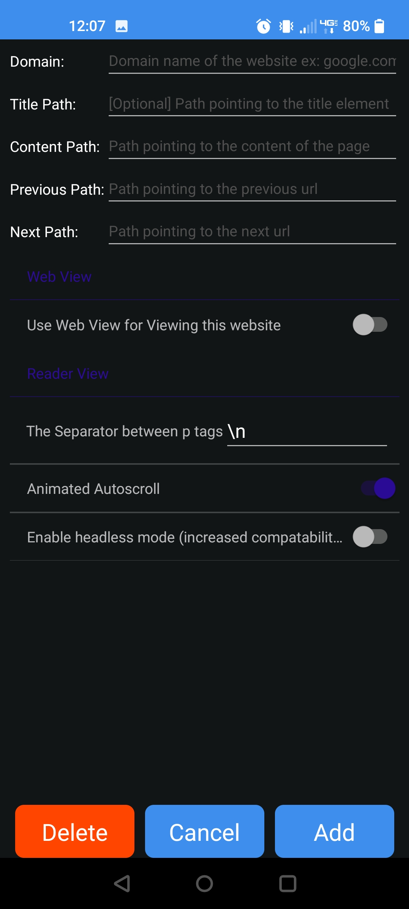

# __Spindler: The Newer Spindle__
An app to simplify web scraping for books and other 'written' media

## Configurations

Add configurations to the configuration screen to inform the app what to scrape.

The app will target using the domain (_example.com_) rather than an entire url (_https://example.com_), so please use the domain of the website instead of full urls to the website.

Path type                    |                Usage
:---------------------------:|:-----------------------------:
Title path                   | Is optional (first title element by default). A selector to get the title of a page, whether that is a chapter title or article title. 
Content Path                 | A selector for the actual chapter / page contents that you want to read. It can handle both __divs__ and individual __p__ tags if needs be. Other text requires the usage of __$text__ or similar.
Previous path                | The path to the link for the previous chapter on a page. This can handle __\<a>__ tag selection as well if the _href_ attribute is not explicitly selected.
Next Path                    | The path to the link for the next chapter on a page. This can handle __\<a>__ tag selection as well if the _href_ attribute is not explicitly selected.

## General Configurations

Identical to the normal configurations, except instead of a domain, there is a name for the configuration as well as the match path.

Path type                    |               Usage
-----------------------------|:-----------------------------:
Config Name                  | A name to uniquely identify the general configuration. No restrictions on characters or format.
Match path                   | A path that matches any element on the page. If the element exists, the scraper assumes that the general configuration for the page is valid. __Please make the match path select a unique element of the page (not present in websites that don't match the template)__.
## Extra configuration parameters
Configuration                |              Usage
:---------------------------:|:-----------------------------:
Use web view for viewing this website                                                                                   | A toggleable option for using the built in android webview in order to view a website in its native format, with css and all.
The separator between p tags | Configure the separator between paragraph tags. Use _\\n_ in place of line breaks and _\\t_ in place of tabs. You can even use normal characters as separators if you truly want to.
Animated Autoscroll          | A toggleable option to remove the animation for scrolling down to the reading position of the chapter. With this removed, scrolling down to the saved scroll location is instant.
Enable headless mode         | Turn on headless mode. This uses a builtin browser to obtain html from a website. This approach increases compatibility with all sorts of websites in exchange for a bit of speed and the ability to preemptively load content.
### Supports Csspaths and Xpaths natively

#### Csspaths
-------------------------------------------------------------
If you add a _$_ after a normal css path, it will target that attribute.

`a.chapter $href` will target the `href` attribute of an `<a>` tag with the class 'chapter'.

For paths, the href attribute is prioritized, so if you want to get the text content of the `<a>` tag, you can use the modifier `$text`.

#### Xpaths
-------------------------------------------------------------
Xpaths also have the ability to use _$ syntax_. This is generally not needed, however, because they allow you to target individual attributes by default.
